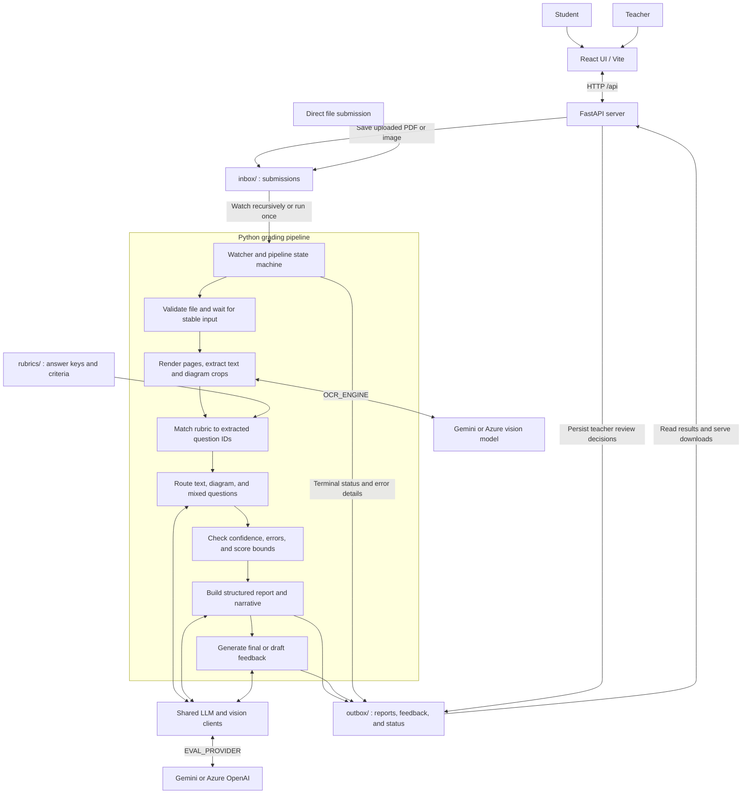
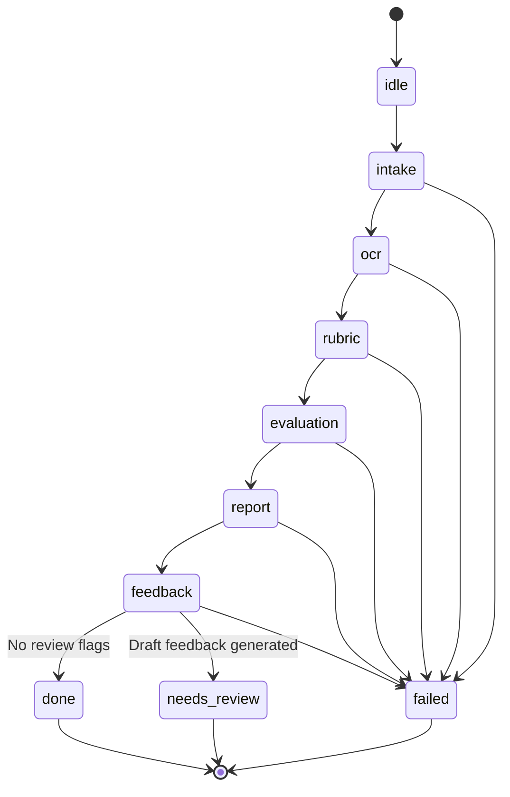

# intel-innovation-automated-assignment-grading

## Quick Start

### Prerequisites
- Python 3.12+, virtual environment
- Node.js 18+ (for UI)
- API key: `GEMINI_API_KEY` or `AZURE_OPENAI_API_KEY`

### 1. Install dependencies

```bash
# Backend (grading pipeline)
python -m venv .venv && source .venv/bin/activate
pip install -r requirements.txt

# Server (API for UI)
pip install -r server/requirements.txt

# Frontend
cd ui && npm install && cd ..
```

### 2. Set environment variables

```bash
# OCR (pick one)
export OCR_ENGINE="gemini"              # or "azure"
export GEMINI_API_KEY="your-key"        # required for gemini engine

# Evaluation provider (pick one)
export EVAL_PROVIDER="azure"            # or "gemini"

# Azure Foundry (if using azure)
export AZURE_OPENAI_API_KEY="your-key"
export AZURE_OPENAI_ENDPOINT="azure foundry url"
export AZURE_OPENAI_DEPLOYMENT="gpt-4.1"
```

### 3. Run the OCR pipeline

```bash
# Verify OCR on a submission (writes debug output to outbox/ocr_debug/)
.venv/bin/python3 scripts/verify_ocr.py inbox/submission.pdf

# Dump OCR result as JSON for evaluation
.venv/bin/python3 scripts/verify_ocr.py inbox/submission.pdf --dump-json inbox/submission.json
```

### 4. Run the evaluator

```bash
# Grade a submission using OCR JSON output + rubric
.venv/bin/python3 scripts/process_ocr_output.py inbox/submission.json

# With explicit rubric file
.venv/bin/python3 scripts/process_ocr_output.py inbox/submission.json --rubric rubrics/physics.yaml
```

Output: `outbox/<name>_report.json` and `outbox/<name>_feedback.txt`

### 5. Run the agentic watcher (end-to-end)

```bash
# Continuous watch — monitors inbox/, auto-grades new submissions
.venv/bin/python3 -m src.watcher

# One-shot — process all existing inbox files and exit
.venv/bin/python3 -m src.watcher --once
```

The agent runs: `inbox/ → OCR → rubric → evaluation → report → feedback → outbox/`
- Retries transient failures (API 503s) with exponential backoff
- Flags low-confidence questions for teacher review
- Writes `outbox/<name>_status.json` with final state and any errors

### 6. Generate feedback from an existing report

```bash
.venv/bin/python3 scripts/generate_feedback.py outbox/submission_grading_report.json
```

### 7. Run the UI

Keep the watcher from step 5 running in a separate terminal; the API saves uploads but does not run the grading pipeline itself.

```bash
# Terminal 1: Backend API (reads live grading artifacts)
cd server && uvicorn app:app --reload --port 8000

# Terminal 2: Frontend
cd ui && npm run dev
```

Open http://localhost:3000
- **Student:** Upload assignments, view scores
- **Teacher:** Review flagged submissions, override scores, release to students

---

## Architecture

The application is a file-backed grading system with three independently running processes: a React UI, a FastAPI server, and a Python watcher. The UI communicates with the server over HTTP. The server saves submissions to disk, while the watcher discovers and grades them asynchronously. Reports, feedback, and status files are the shared contract between the watcher and the API; there is no database or message broker in the current implementation.

The workflow is "agentic" in the sense that it processes submissions unattended, retries failed steps, and flags uncertain results for teacher review. Its orchestration is an explicit Python state machine, not an LLM planner. Cloud models perform OCR, answer evaluation, report narrative generation, and student feedback generation.

### Components and Data Flow



| Component | Responsibility | Implementation |
| --- | --- | --- |
| Web UI | Student uploads and results; teacher dashboard and review screens. | [ui/src/App.jsx](ui/src/App.jsx), [ui/src/pages](ui/src/pages) |
| HTTP API | Save uploads, expose grading status and results, serve reports and original answer sheets, and handle teacher review requests. | [server/app.py](server/app.py) |
| Watcher | Discover supported files, sanitize filenames, wait for writes to settle, skip unchanged terminal submissions, and mirror input subdirectories in the output tree. | [src/watcher/monitor.py](src/watcher/monitor.py) |
| Pipeline | Control stage transitions, retry failures, enforce rubric coverage and score bounds, flag review cases, and write terminal status. | [src/watcher/pipeline.py](src/watcher/pipeline.py) |
| OCR | Convert PDFs/images into page images, recognize content using a cloud vision model, and group text and diagram crops into question/answer records. | [src/ocr/preprocessor.py](src/ocr/preprocessor.py), [src/ocr/extractor.py](src/ocr/extractor.py) |
| Rubric loader | Resolve grading criteria and answer keys for a submission. The pipeline rejects missing rubrics or missing criteria for extracted question IDs. | [src/rubric/loader.py](src/rubric/loader.py) |
| Evaluation | Select text, vision, or mixed evaluation and return per-question scores, reasoning, confidence, and review flags. | [src/evaluation/router.py](src/evaluation/router.py) |
| Reports and feedback | Combine evaluations into a structured report and narrative, then generate student-facing feedback or a teacher-review draft. | [src/report/generator.py](src/report/generator.py), [src/feedback/generator.py](src/feedback/generator.py) |
| Provider clients | Supply shared text and vision interfaces with lazily loaded Gemini or Azure implementations. OCR and evaluation providers are selected independently. | [src/client/__init__.py](src/client/__init__.py), [src/config/settings.py](src/config/settings.py) |

### Grading Lifecycle

1. **Intake:** Accept PDF, PNG, JPG, or JPEG submissions. UI uploads are stored under `inbox/<exam>/<subject>/<roll_no>/`; direct file placement and one-shot batch processing are also supported. The watcher waits for a stable file before starting the pipeline.
2. **OCR and rubric matching:** Render page images, extract question text, student answers, and diagram crops, and load the corresponding rubric. Question IDs greater than zero are gradable; header/metadata blocks are excluded from evaluation. Missing questions or rubric coverage stop the pipeline.
3. **Evaluation:** Independent questions run in a thread pool (four workers by default). If an answer contains a detected backreference, the whole submission is evaluated sequentially with prior question/answer/score context. Text questions use an LLM, diagrams use a vision client, and mixed questions use both. Mixed evaluation selects the higher-confidence result and flags substantial score disagreement.
4. **Review decision:** Apply rubric score limits and collect review flags from evaluation errors, low confidence, and disagreements. A flagged submission still receives a report and feedback, but its feedback is marked as a draft and its terminal state is `needs_review`.
5. **Report and feedback:** Write the structured grading report, Markdown narrative, and PDF. Initial PDF generation is part of the report step and can fail that step. Generate feedback from the report and append it to the Markdown report; subsequent PDF regeneration with feedback is best-effort.
6. **Completion:** Persist `done`, `needs_review`, or `failed` with scores, flagged questions, errors, artifact paths, step timings, and attempt counts. The API reads these files to serve the UI. Teacher review is a separate API/UI workflow, not an automatic state-machine step.



Each step has up to three attempts with exponential backoff (2 seconds, then 4 seconds). `FileNotFoundError` and `ValueError` fail immediately. Other exceptions that escape a stage are retried; individual question evaluation errors can instead become flagged scores so the report can still be produced.

### Storage and Process Boundaries

For a submission named `answer.pdf`, outputs use the same relative directory beneath `outbox/` as the input uses beneath `inbox/`:

| Artifact | Purpose |
| --- | --- |
| `answer_grading_report.json` | Structured question-level evaluations and aggregate scores. |
| `answer_grading_report.md` | Human-readable report with appended feedback. |
| `answer_grading_report.pdf` | Downloadable report when PDF generation succeeds. |
| `answer_feedback.txt` | Feedback for a submission without review flags. |
| `answer_feedback_draft.txt` | Draft feedback when teacher review is required. |
| `answer_status.json` | Terminal pipeline state, source metadata, timings, attempts, errors, and artifact paths. |

The API and watcher must share the same filesystem paths. The API currently uses the repository's `inbox/` and `outbox/` directories and a fixed `june_exam_2026` exam name; keep the watcher's directory configuration aligned with those paths. The API serves live artifacts but does not launch or supervise the watcher. The scripts in [scripts](scripts) provide manual OCR, evaluation, feedback, and PDF entry points outside the continuous watcher workflow.

Idempotency is based on an existing terminal status plus the source file's size and modification time, not content hashes. Unchanged `done` and `needs_review` submissions are skipped; unchanged failures are also skipped unless `WATCHER_REPROCESS_FAILED_SUBMISSIONS` is enabled. Status is written at pipeline completion or failure, so it is not a persisted live progress feed or a checkpoint for resuming midway through a stage.

### Current Limitations

- Persistence is local-file based. Database-backed execution tracking, content-hash deduplication, and cached evaluation/feedback results are not implemented.
- OCR page content and grading inputs are sent to the configured cloud providers. Use appropriate data-handling controls for student submissions and keep provider credentials outside version control.
- Student and teacher screens are workflow views, not an authentication or authorization boundary. Production access control and enforced release policies require additional work.
- Telegram/student chat integration remains a future extension, not part of the running architecture.
